# Rayan Van den Bossche - Student 1, Yousri Khalfallah - Student 2
## Tutorial installatie en configuratie Datawarehouse

## stap 1
### velo db inladen
``` shell
Om te kunnen beginnen moet je connectie maken met Postgres. Doe dit door rechts op je databank te klikken.
Klik dan op het kruisje om de nieuwe databank aan te maken.
Configureer dit juist en dan kan je beginnen met je databanken te maken.
Hier gaan we zowel een databank dat als datawarehouse dient aanmaken, en een de operationele databank waar alle gegevens in staan.


We beginnen met het inladen van de databank. Maak een aparte directory aan in je mappenstructuur.
Sleep alle nodige bestanden in deze directory.
Run dit op je 

``` 
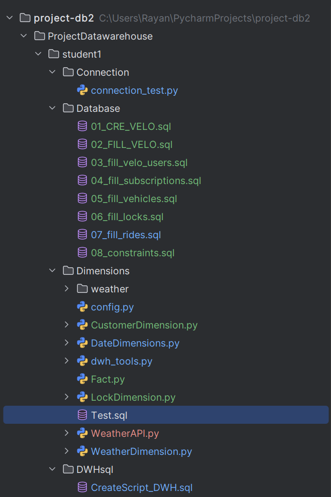
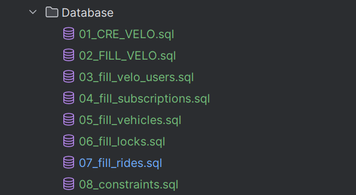
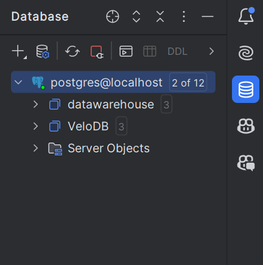

## stap 2
### create script lege tables
``` shell
We gaan nu onze datawarehouse databank aanvullen met lege tabellen.
Aan de hand van verschillende create tables gaan we dit doen.
Zie foto en voorbeeld:

"CREATE TABLE IF NOT EXISTS dim_date (
    date_sk SERIAL PRIMARY KEY,      -- Surrogaatsleutel
    date DATE NOT NULL,              -- De feitelijke datum
    year INTEGER NOT NULL,           -- Jaar
    quarter INTEGER NOT NULL,        -- Kwartaal (1-4)
    month INTEGER NOT NULL,          -- Maand (1-12)
    month_name VARCHAR(20) NOT NULL, -- Naam van de maand
    day_of_month INTEGER NOT NULL,   -- Dag van de maand (1-31)
    day_of_week INTEGER NOT NULL,    -- Dag van de week (1=maandag, 7=zondag)
    weekday_name VARCHAR(20),        -- Naam van de dag
    is_weekend BOOLEAN               -- True als het een weekend is, anders False


);
"

```
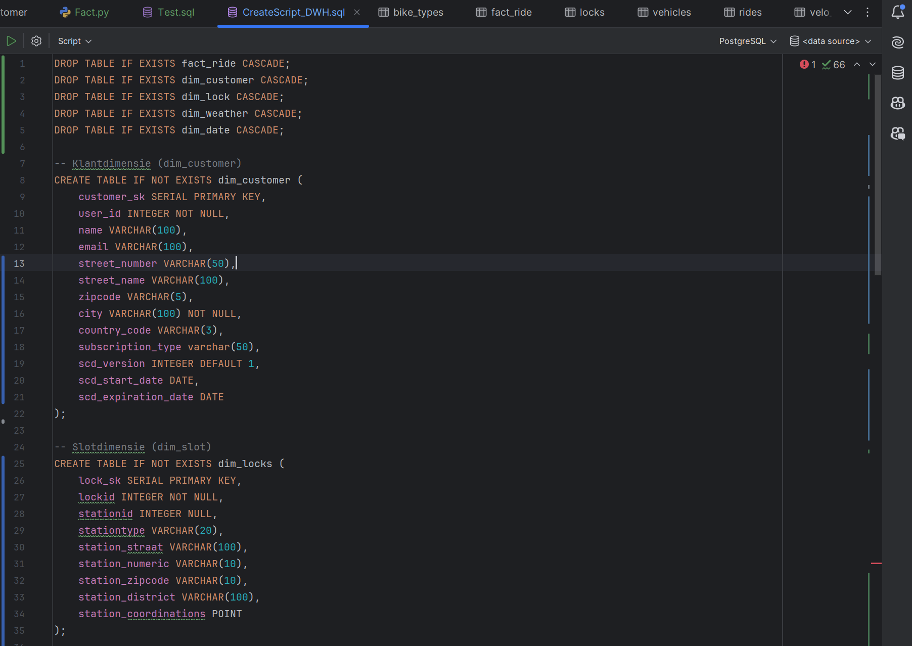


## stap 3
### connectie maken
``` shell
Om er voor te zorgen dat we onze databanken ook kunnen aanspreken in onze files, moeten we een connectie maken.
Dit doen we in de Config.
Hierin geef je de Server,DATABASE_OP,DATABASE_DWH,USERNAME,PASSWORD en PORT aan.

Met een import ga je hier later ook aan kunnen in je files.
``` 
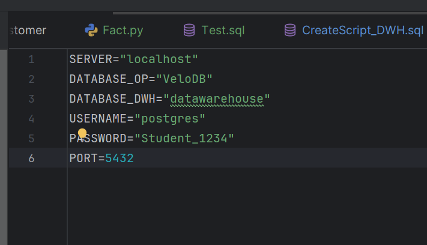


## stap 4
### dimensies maken
``` shell
Nu moeten we de verschillende dimensies maken die in de opgave zijn gevraagd. Dit zijn de Lock, Customer, Weather en Date dimensies.
Met deze dimensies kunnen we de lege tabellen die zijn aangemaakt in onze datawarehouse vullen met de gegevens die we nodig zullen hebben.


```
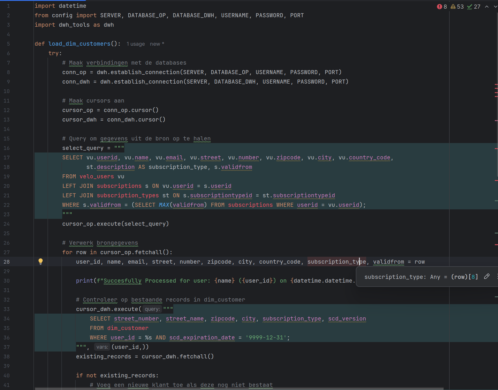
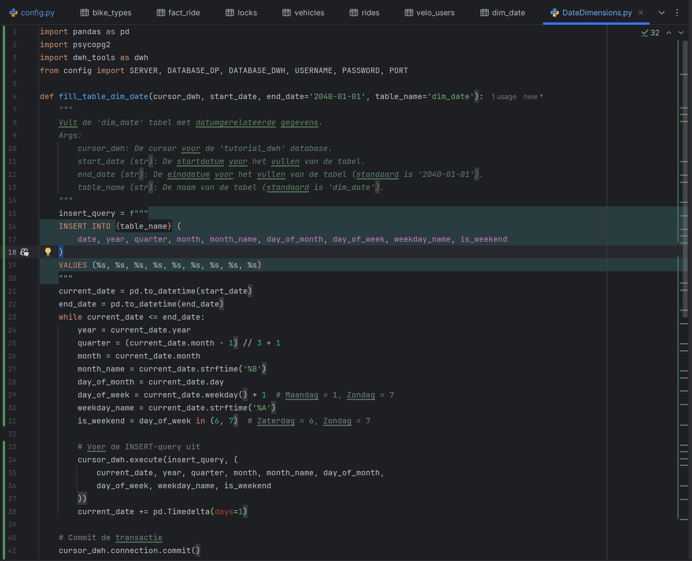
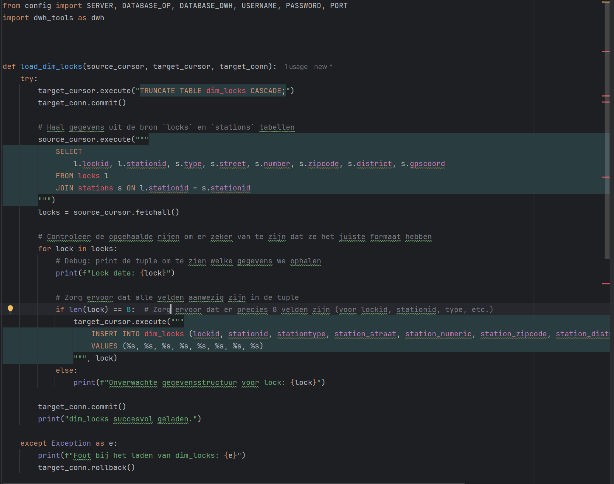
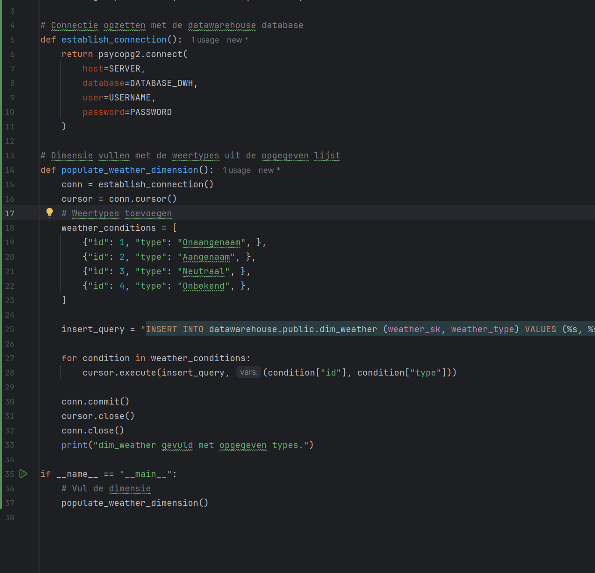
## stap 5
### weather API
``` shell
Onze weather dimensie is een beetje moeilijker. De dimensie zelf is heel eenvoudig maar hier moet nog een API voor worden bij gemaakt.
Deze API zorgt ervoor dat we JSON bestandjes terug krijgen met verschillende gegevens in.
Zie voorbeeld:

Aan de hand van deze JSON bestanden gaan we in onze feit de weather key terug krijgen die ons de weeromstandigheden verteld.
Deze haalt hij dan ook uit de dimensie die op voorhand is gemaakt.


``` 
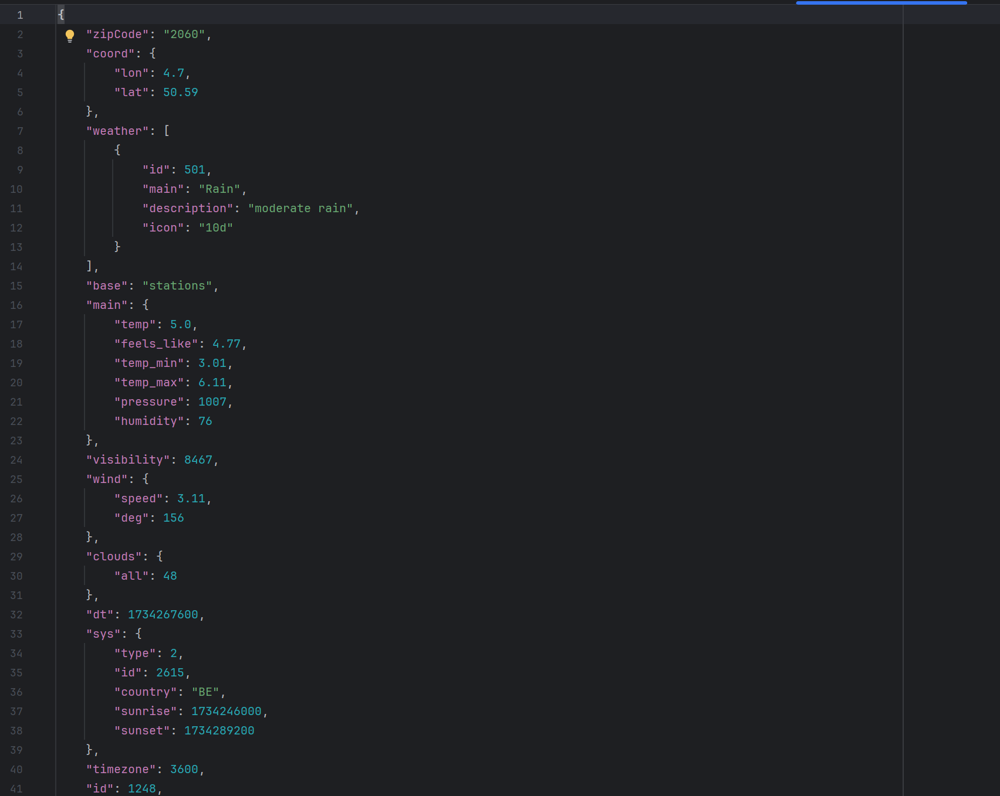
## stap 6
### Functie
``` shell

De functie haversine_km is een functie die de cirkelafstand (haversine-afstand) tussen twee punten berekent, gegeven hun breedte- en lengtegraden. Deze afstand wordt uitgedrukt in kilometers.


"
functie :CREATE OR REPLACE FUNCTION haversine_km(
    lat1 double precision, lon1 double precision,
    lat2 double precision, lon2 double precision
)
RETURNS double precision AS $$
DECLARE
    distance double precision;
BEGIN
    IF lat1 = lat2 AND lon1 = lon2 THEN
        RETURN 0;  -- Afstand is 0 km als de coördinaten hetzelfde zijn
    END IF;

    SELECT 6371 * ACOS(
        COS(radians(lat1)) * COS(radians(lat2)) *
        COS(radians(lon2) - radians(lon1)) +
        SIN(radians(lat1)) * SIN(radians(lat2))
    ) INTO distance;

    RETURN distance;
END;
$$ LANGUAGE plpgsql IMMUTABLE;
"
``` 

## stap 7
### ### fact 

``` shell
Na het maken van de dimensies en de nodige gegevens in onze datawarehouse te steken moeten we nu het feit maken.
Hierin staat een ETL-proces (Extract, Transform, Load) uit om ritgegevens te verwerken en op te slaan in onze datawarehouse.

De load_weather_data functie leest alle JSON-bestanden in de WEATHER_FOLDER en slaat de gegevens op in een gestructureerde weather_data dictionary.

De find_weather_sk functie bepaalt de juiste weather_sk (sleutel in de weerdimensietabel) voor een rit.

De calculate_distance functie berekent de afstand tussen twee locaties met de haversine-formule, gebaseerd op coördinaten.

De load_fact_rides functie is verantwoordelijk voor het hele ETL-proces van ritgegevens naar de fact_ride-tabel in het datawarehouse.

-Extract
Verbindt met de brondatabase en haalt ritgegevens op:
Ritten: Details over de start- en eindtijden, begin- en eindlocaties, en de gebruiker.
Dimensies:
-dim_locks: Details over fietsenstallingen (bijv. coördinaten, postcode).
-dim_date: Tabel met datum-informatie.
-dim_customer: Klantgegevens.

-Transform
De gegevens worden gecombineerd en verrijkt:
Mapping: Gegevens uit dimensietabellen worden aan de ritten gekoppeld via sleutels (bijv. lock_sk, date_sk, customer_sk).
Weather SK: Zoekt het juiste weertype op basis van postcode en timestamp.
Afstand berekenen: Berekening van de afgelegde afstand (km) tussen de start- en eindlocatie.
Duur berekenen: De ritduur wordt berekend in minuten.

-Load
De verrijkte ritgegevens worden ingeladen in de fact_ride-tabel van het datawarehouse:
Kolommen:
-customer_sk: Klant-SK.
-lock_sk_start en lock_sk_end: Begin- en eindstalling.
-start_date_sk en end_date_sk: Datumsleutels.
-weather_sk: Sleutel naar het weertype.
-duration_minutes: Duur van de rit in minuten.
-distance_km: Afgelegde afstand in kilometers.
``` 
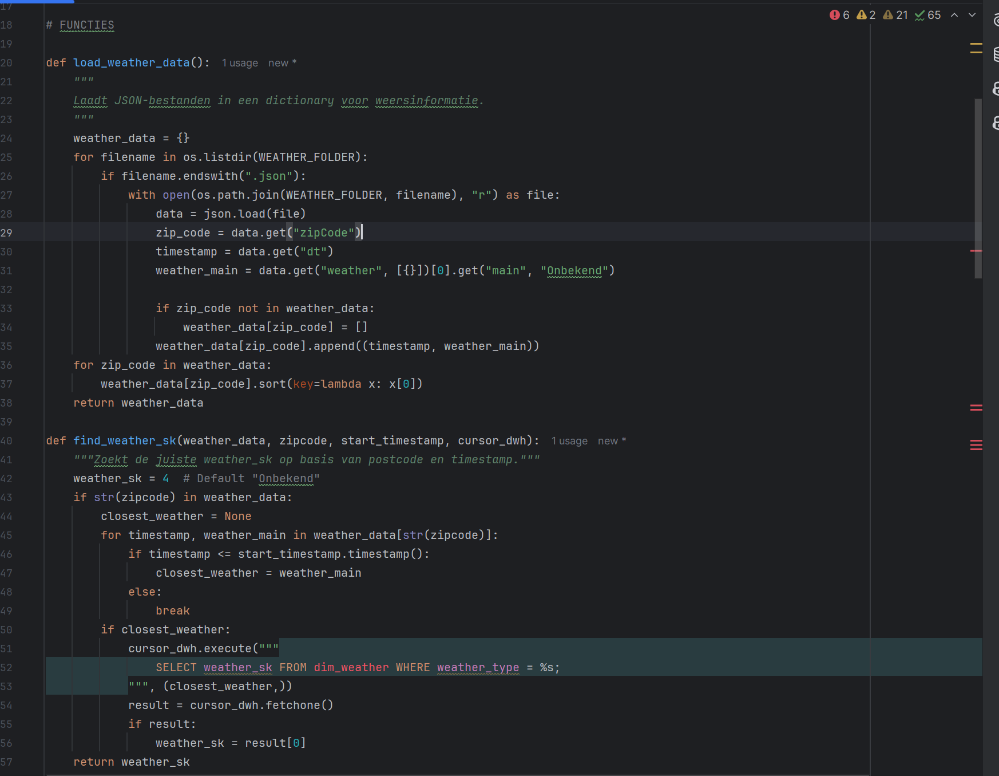