# Rayan Van den Bossche - Student 1
## Tutorial installatie en configuratie MongoDB

## stap 1
### Installeer mongoDB
``` shell
Om te kunnen beginnen ga je mongoDB zelf moeten installeren met de volgende link:
https://www.mongodb.com/try/download/community


Kies het juiste platform, selecteer het MSI-pakket en zorg dat je de laatste versie downloadt.
Volg de installatie-instructies totdat je op 'Complete' kunt klikken. Hierna verschijnt het volgende scherm.


Zorg ervoor dat je de optie 'Run as a Service' uitvinkt.
Nu wordt MongoDB Compass geopend.

``` 
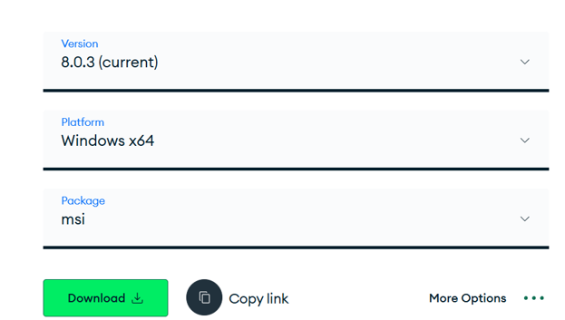
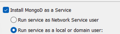

## stap 2
### Installeer mongosh
``` shell
Met deze link installeer je Mongosh. Dit is een shell waarmee je later in je terminal kunt werken.
Je zal hier verschillende zaken moeten configureren die we later in deze tutorial zien.
https://www.mongodb.com/try/download/shell


Kies het juiste platform, selecteer het MSI-pakket en zorg dat je de laatste versie downloadt.
De installatieprocedure is vergelijkbaar met die van Compass.

```


## stap 3
### Installeer mongotools
``` shell
Gebruik deze link om MongoDB Tools te installeren. Hiermee kun je later in je terminal mongoimport gebruiken. 
Dit wordt verderop uitgelegd.
https://www.mongodb.com/try/download/database-tools


Kies het juiste platform, selecteer het MSI-pakket en zorg dat je de laatste versie downloadt.
``` 


## stap 4
### Eventueel het juiste pad kiezen voor je shell en tool
``` shell
Controleer in je opdrachtprompt of de commando's mongosh -h en mongoimport --help werken.
Als dit niet lukt betekent het dat je het pad moet aanpassen.
Dit doe je door naar je 'Environment Variables' te gaan. Hierna ga je door naar enviroment variables en dubbel klik je op 'Path'.
Kopieer hier het adres van je gedownloadde tools in.

Nu zou het testje van hierboven wel moeten lukken.

```
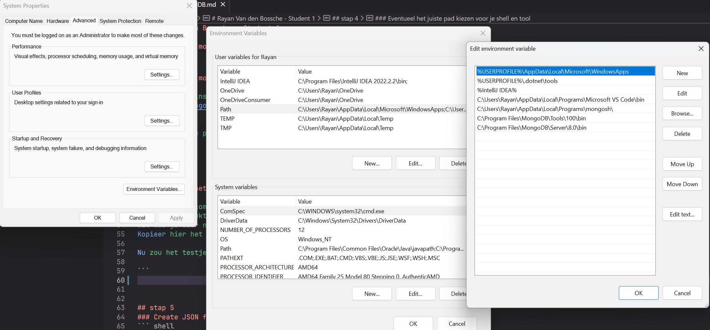


## stap 5
### Create JSON file in je IDE
``` shell
Voor de opdracht moeten we in SQL een query uitvoeren en het resultaat teruggeven in JSON-formaat.
Hier begin je mee door je databank in je gewenste IDE te steken, bij mij is dit Pycharm.

Hier voerde ik de volgende query uit waardoor ik de uitkomst van volgende vraag terug kreeg in JSON formaat.


"
SELECT json_build_object(
    'bike_type', bt.biketypedescription,
    'ride', json_build_object(
        'start', json_build_object(
            'latitude', r.startpoint[1],  -- Y-coördinaat voor startpunt latitude
            'longitude', r.startpoint[0]  -- X-coördinaat voor startpunt longitude
        ),
        'end', json_build_object(
            'latitude', r.endpoint[1],    -- Y-coördinaat voor eindpunt latitude
            'longitude', r.endpoint[0]    -- X-coördinaat voor eindpunt longitude
        ),
        'start_time', r.starttime,
        'end_time', r.endtime,
        'vehicle', json_build_object(
            'vehicle_id', v.vehicleid,
            'lock_id', l.lockid
        )
    )
) AS ride_data
FROM bike_types bt
JOIN bikelots bl ON bt.biketypeid = bl.biketypeid
JOIN vehicles v ON bl.bikelotid = v.bikelotid
JOIN locks l ON v.lockid = l.lockid
JOIN rides r ON l.lockid = r.endlockid;
"

De query levert voor elke combinatie van ritten, voertuigen en fietstypes een JSON-representatie met gedetailleerde informatie.
Een werkende query met als output alle gevraagde info:
ZIE IMAGES

``` 
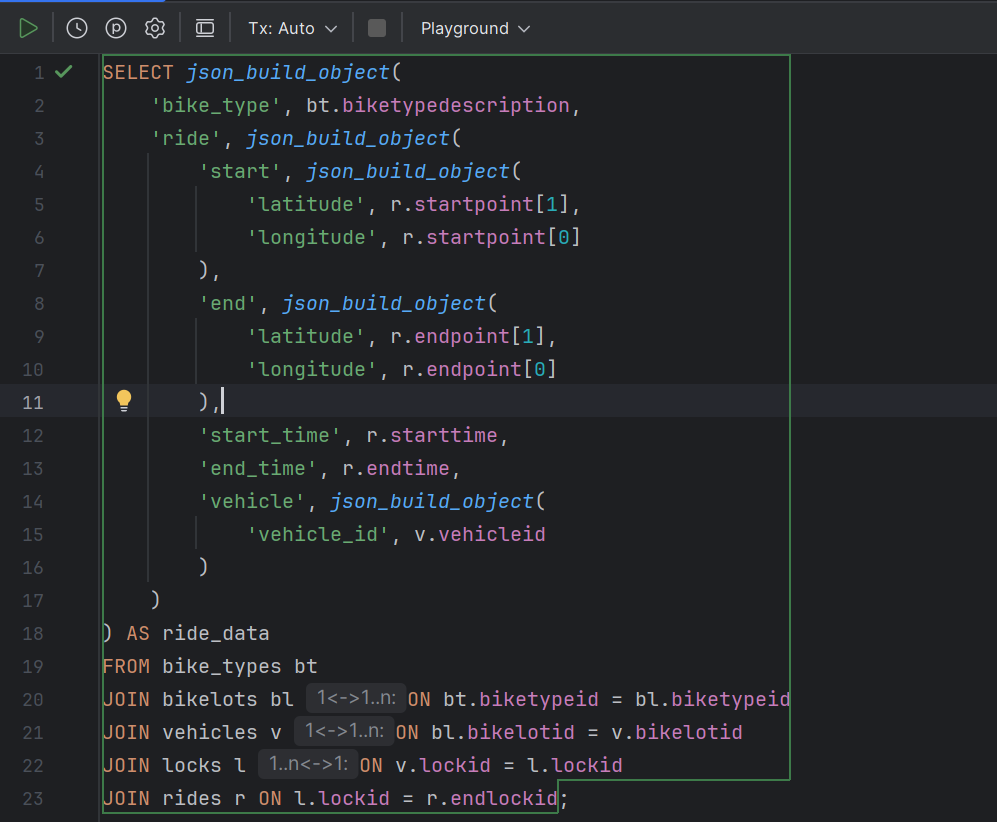
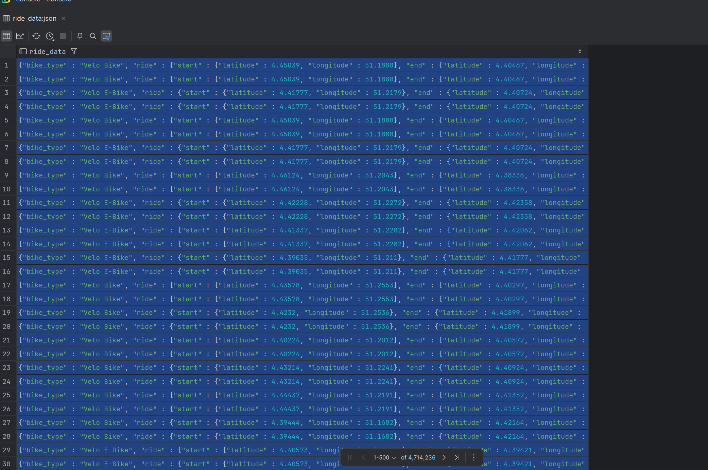

## stap 7
### Export JSON file
``` shell
Je kan rechtsonder na het runnen van je query, deze file downloaden in JSON formaat en opsturen naar een bestand.
Maak in je bestanden aparte mappen aan voor elk van de drie shards en hun bijbehorende twee replica-sets.
``` 
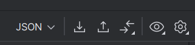
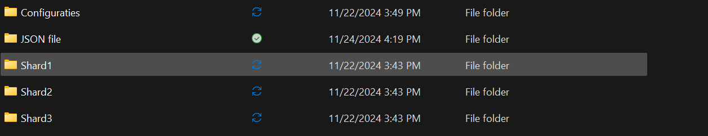

## stap 8
### Maak servers voor je replicasets  aan
``` shell
MongoDB en chatgpt raadt aan om 3 servers aan te maken voor een goede redundantie.
Dit hebben we lokaal gedaan op onze PC via de terminals.
Door op windows+r te drukken en daar cmd in te geven kan je snel op je commandprompt komen.

Hier geef je 3 commandos in:
1- mongod --configsvr --replSet Confserver1 --port 27019 --dbpath "C:\Users\Rayan\OneDrive\Bureaublad\DB2 Json Files\Configuraties\Config1" --bind_ip localhost

2- mongod --configsvr --replSet Confserver1 --port 27020 --dbpath "C:\Users\Rayan\OneDrive\Bureaublad\DB2 Json Files\Configuraties\Config2" --bind_ip localhost

3- mongod --configsvr --replSet Confserver1 --port 27021 --dbpath "C:\Users\Rayan\OneDrive\Bureaublad\DB2 Json Files\Configuraties\Config3" --bind_ip localhost

Dit commando houdt in:

-	Mongod 
	Je roept de MongoDB database server op. 

-	--Configsvr
	Dit betekent dat je hier een config server van maakt.

-	--replset ConfServer1
	Dit zorgt ervoor dat mongoDB weet dat het hoort tot je replicaset.

-	--port 
	Dit zorgt ervoor dat de server opent op poort  (Dit kan eender welke poort zijn, chatpt koos deze voor mij.)

-	--dbpath + een opgegeven pad
	Dit is de plek waar je alles zal opslaan. (in je verkenner gewoon het adres kopieren)

-	--bind_ip localhost
	Dit is voor de veiligheid, alleen jij kan aan deze server nu.


De naam van de replica-set, zoals 'Confserver1', moet consistent zijn. Anders herkennen de servers elkaar niet.

Dit is een runnende server op de foto:

``` 
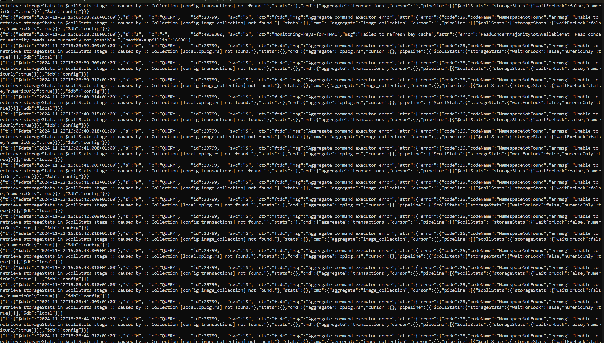

## stap 9
### shell openen in terminal om te configureren.
``` shell
LEES ZEKER VOLGENDE STAP, HET VALT SAMEN MET DEZE STAP!


Zorgen dat deze servers replicas zijn van elkaar doe je als volgt:
Je opent nog een terminal met je sneltoets wind+r en enter.
Hierin geef je het commando mongosh in dat eerder werd geïnstalleerd.
Mongosh + de poort dat is meegegeven bij de commandos ervoor waar je de servers aanmaakte.
mongosh --port 27019

Dit geeft het volgende resultaat:

``` 
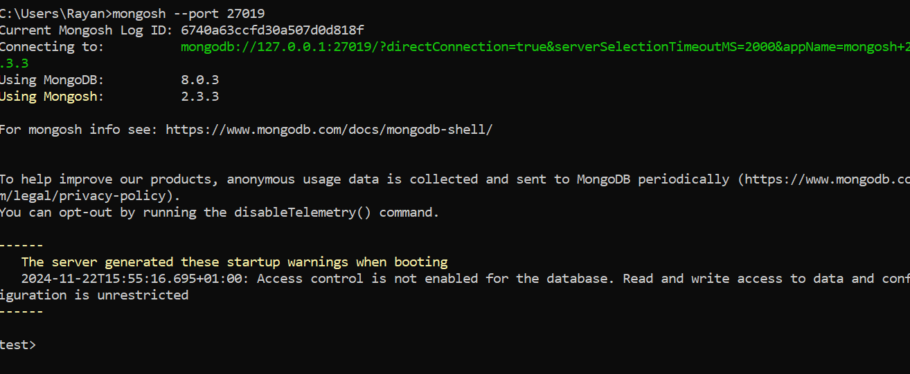
## stap 10
### replicaset aanmaken met bijhorende members.
``` shell
We willen nu een replicaset aanmaken, met als naam "Confserver1" en als members de servers die toebehoren bij deze replica set .
Dit deden we met dit commando:

rs.initiate({ _id: "Confserver1", members: [ { _id: 0, host: "localhost:27019" }, { _id: 1, host: "localhost:27020" }, { _id: 2, host: "localhost:27021" } ] })

_id: "Confserver1":

Naam van de replica set is "Confserver1".
members:

Definieert de servers (nodes) die deel uitmaken van de replica set:
Node 0: localhost:27019
Node 1: localhost:27020
Node 2: localhost:27021

Je krijgt het volgende terug als het correct is gebeurd:

Gebruik rs.status() om te zien of dit correct gebeurde.
``` 
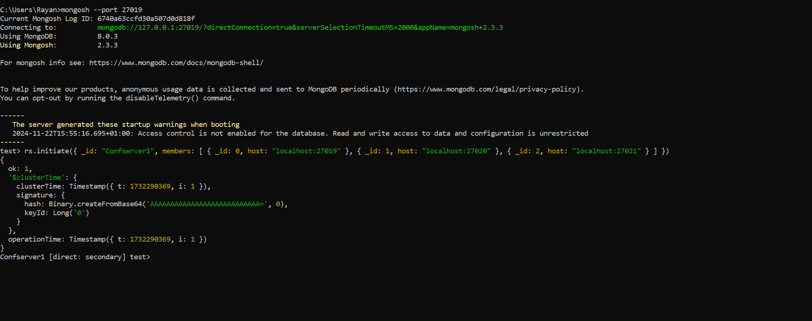

## stap 11
### Shards bij hun replicaset steken
``` shell
Nu gaan we de shards maken en hun bijbehorende replicasets aan toevoegen.


Voor shard 1:
mongod --shardsvr --replSet shardServer1 --port 27028 --dbpath "C:\Users\Rayan\OneDrive\Bureaublad\DB2 Json Files\Shard1\ReplicaSet1" --bind_ip localhost
mongod --shardsvr --replSet shardServer1 --port 27029 --dbpath "C:\Users\Rayan\OneDrive\Bureaublad\DB2 Json Files\Shard1\ReplicaSet2" --bind_ip localhost

Voor shard 2:
mongod --shardsvr --replSet shardServer2 --port 27030 --dbpath "C:\Users\Rayan\OneDrive\Bureaublad\DB2 Json Files\Shard2\ReplicaSet1"  --bind_ip localhost
mongod --shardsvr --replSet shardServer2 --port 27031 --dbpath "C:\Users\Rayan\OneDrive\Bureaublad\DB2 Json Files\Shard2\ReplicaSet2"  --bind_ip localhost

Voor shard 3:
mongod --shardsvr --replSet shardServer3 --port 27032 --dbpath "C:\Users\Rayan\OneDrive\Bureaublad\DB2 Json Files\Shard3\ReplicaSet1" --bind_ip localhost
mongod --shardsvr --replSet shardServer3 --port 27033 --dbpath "C:\Users\Rayan\OneDrive\Bureaublad\DB2 Json Files\Shard3\ReplicaSet2"  --bind_ip localhost

-	Mongod 
	Je roept de MongoDB database server op.

-	--shardsvr
	Dit betekent dat je hier een shard server van maakt.

-	--replSet shardServer
	betekent dat deze server behoort tot de replicaset shardServer.

-	--port 
	Dit zorgt ervoor dat de server opent op poort  (Dit kan eender welke poort zijn, chatpt koos deze voor mij.)

-	--dbpath 
	Dit is de plek waar je alles zal opslaan. (in je verkenner gewoon het adres kopieren)

-	--bind_ip localhost
	Dit is voor de veiligheid, alleen jij kan aan deze server nu.


``` 

## stap 12
### Shards bij hun replicaset steken
``` shell
Nu dat we al onze servers hebben opgestart, zullen we net zoals bij de configuratieservers, ook tegen MongoDB moeten vertellen dat we sommige servers willen gebruiken als replicasets. Dit kan gedaan worden door in te loggen op elke shard, en dit commando in te voeren:

mongosh --port 27028
rs.initiate({ _id: "shardServer1", members: [ { _id: 0, host: "localhost:27028" }, { _id: 1, host: "localhost:27029" } ] })


mongosh --port 27030
rs.initiate({ _id: "shardServer2", members: [ { _id: 0, host: "localhost:27030" }, { _id: 1, host: "localhost:27031" } ] })


mongosh --port 27032
rs.initiate({ _id: "shardServer3", members: [ { _id: 0, host: "localhost:27032" }, { _id: 1, host: "localhost:27033" } ] })

``` 

``` shell
Ondertussen heb je waarschijnlijk al meer dan 10 terminals open staan die aan het runnen zijn. 
Dit is een goed teken en het zullen er zeker meer worden. Veel meer.
``` 
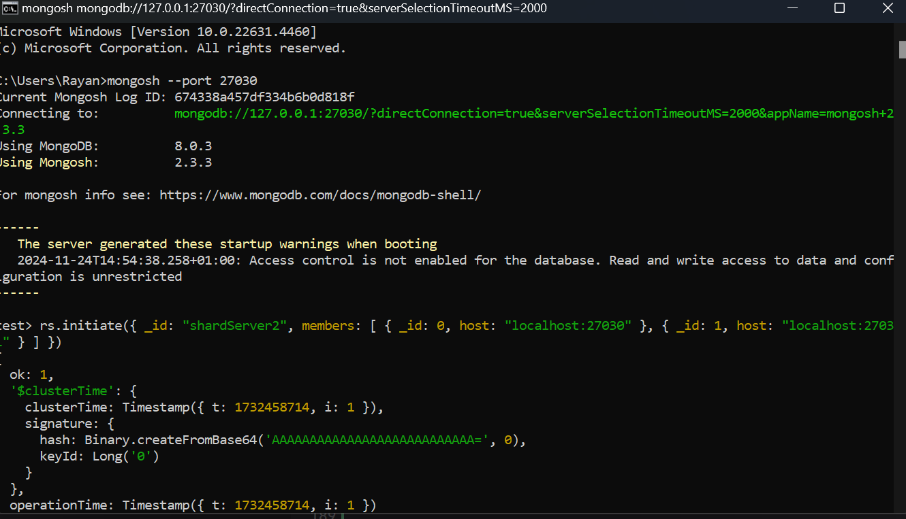

## stap 13
### Klaarzetten MongoS instantie
``` shell
Als laatste, zullen we ook nog moeten aanduiden dat deze shards bij elkaar horen. Dit wordt gedaan met behulp van de MongoS-instantie. 
En omdat we nog steeds niet genoeg terminals open hebben staan, openen we er nog 1.

mongos --configdb Confserver1/localhost:27019 --bind_ip localhost --port 27050


 -	mongos 
	Start je query router process.

-	--configdb Confserver1/localhost:27019
	Hier moet je meegeven welke replicaset server je wilt gebruiken, en geeft een van de members van deze set mee.
    
-	--bind_ip localhost
	Dit is voor de veiligheid, alleen jij kan aan deze server nu.

-	--port 
	Kijkt welke poort er wordt gebruikt voor een connectie. (Dit kan eender welke poort zijn, chatpt koos deze voor mij.)


Nu je deze server hebt gestart kan je een weer nieuwe terminal openen en dit ingeven:
mongosh --port 27050,

Dan deze 3 commandos:
 sh.addShard("shardServer1/localhost:27028")
 sh.addShard("shardServer2/localhost:27030")
 sh.addShard("shardServer3/localhost:27032")

Nu zeg je ook dat we sharding willen gebruiken en dat doen we zo: ("Kies de naam van je DB")
 sh.enableSharding("VeloDB")

```
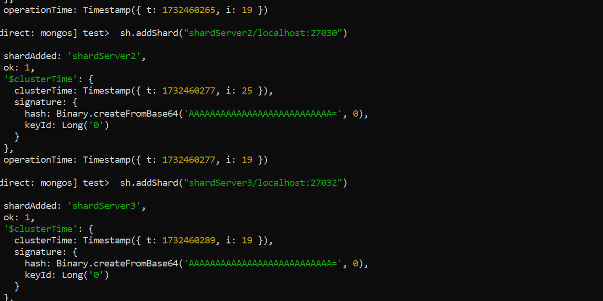


## stap 14
### Import JSON file
``` shell
Momenteel hebben we onze JSON file nog steeds niet geïmport. 
Dit doen we nu ook door weer een nieuwe terminal te openen en dit in te geven:
mongoimport --port 27050 --db VeloDB --collection MyCollection --file "C:\Users\Rayan\OneDrive\Bureaublad\DB2 Json Files\JSON file\VeloDB.json" --jsonArray

--jsonArray zorgt ervoor dat het ingelezen kan worden als een JSON moest het niet beginnen met [].
Deze parameter is nodig als je JSON-bestand geen array bevat.

```
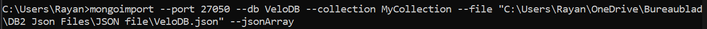
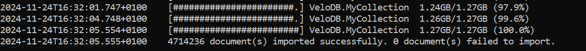


## stap 15
### Het omzetten van je data
``` shell
Nu moet je u data ook nog omzetten om erop te kunnen querien later. 
dit doe je met het volgende commando:

use VeloDB

db.MyCollection.updateMany(
  { "ride_data.ride.start_time": { $type: "string" } },
  [
    {
      $set: {
        "ride_data.ride.start_time": { $toDate: "$ride_data.ride.start_time" },
        "ride_data.ride.end_time": { $toDate: "$ride_data.ride.end_time" }
      }
    }
  ]
);


We maken een index aan zodat we hierop kunnen sorteren met het volgende commando:
db.MyCollection.createIndex({ start_time: 1 })

controleer of de index correct aangemaakt is met:
db.MyCollection.getIndexes()


```


## stap 16
### Nu duiden we aan op wat we sharden (starttime)
``` shell
sh.shardCollection("VeloDB.MyCollection", { "starttime": 1 })
Dit commando configureert de sharding op basis van het veld 'starttime'.
Met dit commando geef je de DB mee die je hiervoor hebt geinstantieert + ". een collection met de naam naar keuze"
Dit doen we nog altijd in dezelfde terminal.
```
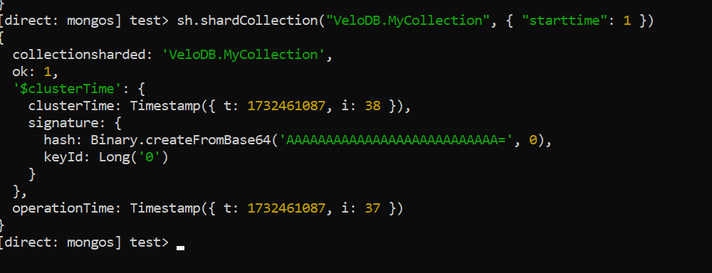


## stap 17
### Compass regelen
``` shell
Ten slotte kunnen we nu beginnen met onze compass te configureren.
Dit is makkelijk gedaan door Connection te maken, en je poort aan te duiden. 
In mijn geval was dit 27050


```
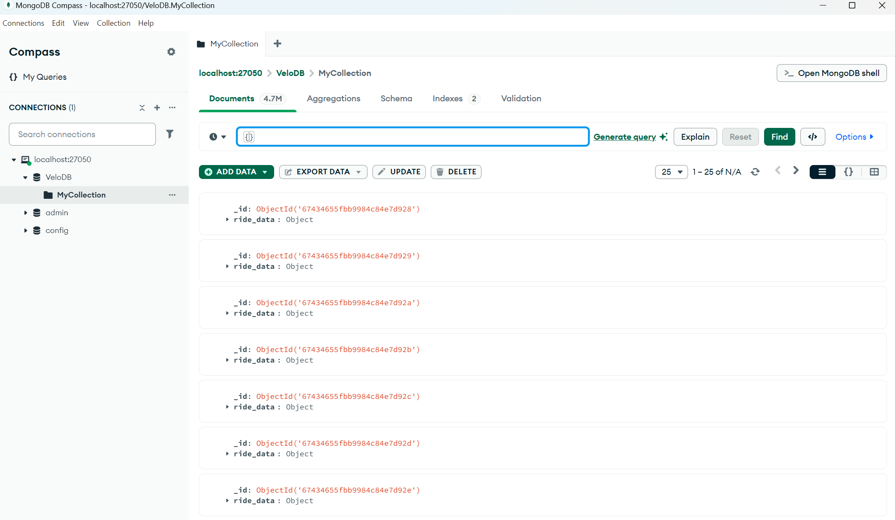

# Nu heb je het gemaakt en ben je klaar !!!!